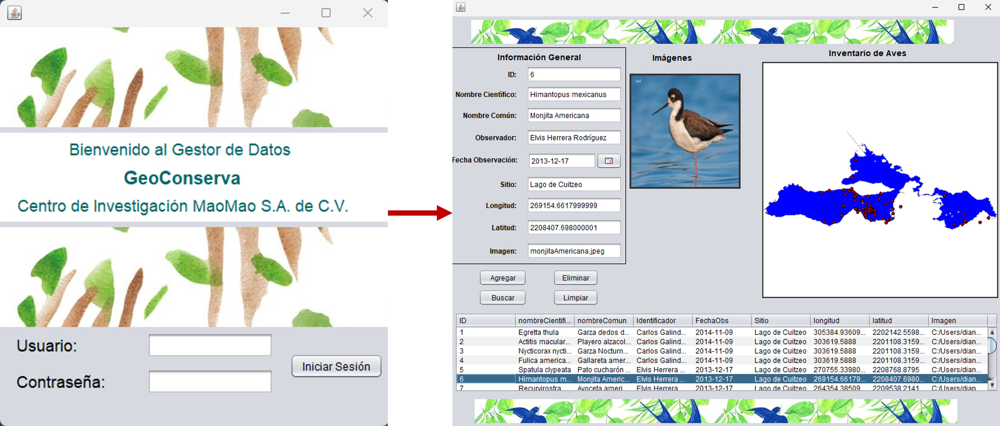

# geoConservaApp 🌍


geoConservaApp is a desktop application tailored for environmental and conservation initiatives.  
It integrates **spatial data visualization**, **database management**, and **interactive UI** using Java.  
The project leverages **GeoTools**, **PostGIS**, and additional libraries to manage and display geospatial data for conservation projects.


## ✨ Features

- 🗺️ **Spatial Data Handling**: Integration with PostGIS and shapefiles using GeoTools.  
- 🔑 **Secure Authentication**: User login validation with SQL and PreparedStatements.  
- 📊 **Interactive Maps**: Visualization of geospatial data with layers, styles, and attribute tables.  
- 🛠️ **Automated Builds**: ANT build scripts for compilation and packaging.  
- 🔌 **Database Connectivity**: PostgreSQL/PostGIS support for spatial queries.  
- 🧩 **Modular Architecture**: Scalable and maintainable structure with reusable classes.  


## 🛠️ Tech Stack

- **Language**: Java 8+  
- **Framework/UI**: Java Swing (JFrame, JPanel, JTable)  
- **Database**: PostgreSQL + PostGIS  
- **ORM/Connectivity**: JDBC + PreparedStatement  
- **GIS Library**: [GeoTools](https://geotools.org/)  
  - `MapContent`, `MapViewport`, `Style`, `Layer`, `SimpleFeatureSource`, `SimpleFeatureCollection`  
  - `Geometry`, `ReferencedEnvelope`, `StyleFactory`, `SLDParser`  
- **Calendar Component**: [JCalendar](https://toedter.com/jcalendar/)  
- **Build Tool**: Apache Ant  
- **Other**: pgJDBC driver, PostGIS extensions, custom SQL functions  


## ⚙️ Installation

1. Clone the repository:
   ```bash
   git clone https://github.com/DianRq/geoConservaApp.git
   cd geoConservaApp
   ```
2. Add required libraries to /lib folder:
- `geotools-*.jar`
- `postgresql-*.jar`
- `jcalendar-*.jar`
3. Configure **PostgreSQL/PostGIS** database.
4. Open project in **NetBeans / IntelliJ** as a Java Application.
5. Run `Main.java`.
---

## 5. 🚀 Usage

- **Login**: Users authenticate using database credentials.  
- **Load Map**: Application fetches spatial data from PostGIS and shapefiles.  
- **Visualization**: Layers are styled dynamically with `StyleFactory` and `SLDParser`.  
- **Filtering**: Attributes can be queried with SQL `PreparedStatement`.  

### Example: Connecting to PostGIS
```java
String url = "jdbc:postgresql://localhost:5432/geodb";
Connection conn = DriverManager.getConnection(url, "user", "password");
PreparedStatement stmt = conn.prepareStatement("SELECT * FROM projects WHERE type = ?");
stmt.setString(1, "conservation");
ResultSet rs = stmt.executeQuery();
```
## Screenshots

## Support

For support, email diana.rios.tc@gmail.com
- LinkedIn [Diana Rios Quiroz](www.linkedin.com/in/diana-rios-quiroz-a77606365)

